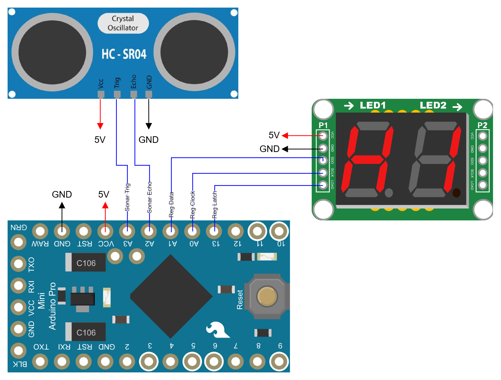
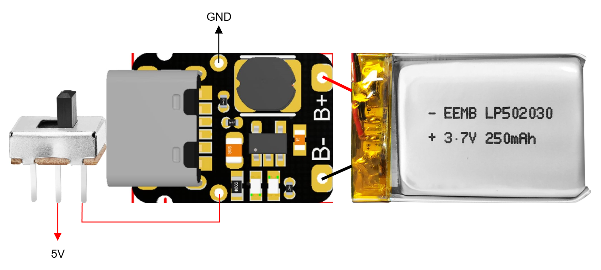

# KINFO Tortúra range finder glasses <!-- omit from toc -->

Arduino sketch for the "KINFO Tortura" range finder glasses

1. [Communication](#communication)
2. [Power supply](#power-supply)

## Communication

The **ATTiny85 MCU** reads the distance from a **HC-SR04 Ultrasonic Distance Sensor** once a second, and displays in on a **2 Digit 7 Segment Display** in meters with one whole number and one decimal.

|  |
| :-: |
| Communications connection diagram |

| Component | Store URL |
| --- | --- |
| ATTiny85 MCU | [https://www.hestore.hu/prod_10028798.html](https://www.hestore.hu/prod_10028798.html) |
| HC-SR04 Ultrasonic Distance Sensor | [https://techfun.hu/termek/hc-sr04-ultrahangos-tavolsagerzekelo](https://techfun.hu/termek/hc-sr04-ultrahangos-tavolsagerzekelo) |
| 2 Digit 7 Segment Display | [https://techfun.hu/termek/szegmenskeszlet-74hc595-meghajtoval-kulonfele-valtozatok/?attribute_pa_valtozatok=2-displeje](https://techfun.hu/termek/szegmenskeszlet-74hc595-meghajtoval-kulonfele-valtozatok/?attribute_pa_valtozatok=2-displeje) |

## Power supply

The electronics are supplied by a **2.7V 250mAh Li-Po battery**, that is charged and protected by a **USB-C Charger & Boost Converter**. The USB changer supplies 5 volts to the electronics.

|  |
| :-: |
| Power supply electronics connection diagram |

| Component | Store URL |
| --- | --- |
| 2.7V 250mAh Li-Po battery | [https://www.hestore.hu/prod_10049028.html](https://www.hestore.hu/prod_10049028.html) |
| USB-C Charger & Boost Converter | [https://www.hestore.hu/prod_10048992.html](https://www.hestore.hu/prod_10048992.html) |
